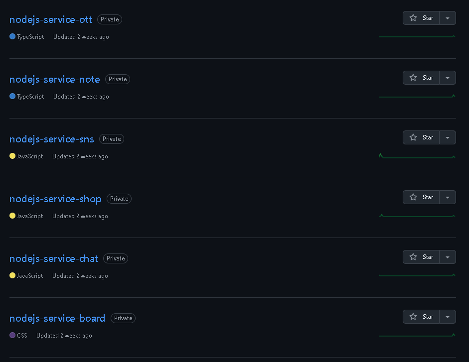

# mpqm-wiki
#### ⚪ 목적
* github 레포지토리에있던 학습용 프로젝트 정리
* github 레포지토리에있던 전공 과제 프로젝트 정리
* github 레포지토리에있던 전공 공부 코드 정리
* github 레포지토리에있던 관리안하는 토이 프로젝트 정리
* R (README 있음) / B (Blog 정리) / X: 단순 저장+

#### ⚪ 토이 프로젝트 바로가기

    

* R [nodejs-service-note](https://github.com/mpqm/my-study/tree/main/nodejs-service-note)
* R [nodejs-service-chat](https://github.com/mpqm/my-study/tree/main/nodejs-service-chat)
* R [nodejs-service-board](https://github.com/mpqm/my-study/tree/main/nodejs-service-board)
* R [nodejs-service-shop](https://github.com/mpqm/my-study/tree/main/nodejs-service-shop)
* R [nodejs-service-ott](https://github.com/mpqm/my-study/tree/main/nodejs-service-ott)
* R [nodejs-service-sns](https://github.com/mpqm/my-study/tree/main/nodejs-service-sns)

#### ⚪ 폴더 바로가기
* X [android](https://github.com/mpqm/my-study/tree/main/android)
* X [c#](https://github.com/mpqm/my-study/tree/main/c%23)
* X [c++](https://github.com/mpqm/my-study/tree/main/c%2B%2B)
* X [CICD](https://github.com/mpqm/my-study/tree/main/CICD)
* X [githubTemplate](https://github.com/mpqm/my-study/tree/main/githubTemplate)
* X [htmlcss](https://github.com/mpqm/my-study/tree/main/htmlcss)
* R [hyperledgerfabric](https://github.com/mpqm/my-study/tree/main/hyperledgerfabric)
* X [java](https://github.com/mpqm/my-study/tree/main/java)
* X [javascript](https://github.com/mpqm/my-study/tree/main/javascript)
* R [machinelearning](https://github.com/mpqm/my-study/tree/main/machinelearning)
* R [nestjs](https://github.com/mpqm/my-study/tree/main/nestjs)
* R [nodejs](https://github.com/mpqm/my-study/tree/main/nodejs)
* X [SQL](https://github.com/mpqm/my-study/tree/main/SQL)
* R [vuejs](https://github.com/mpqm/my-study/tree/main/vuejs)