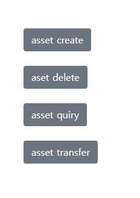

<!-- 제목 -->
<p align="center">
   01. asset
</p>

<!-- 프로젝트 대표 이미지 -->
<div align="center">
        
</div>

<!-- 홈페이지 링크
<div align=center>
    <h3>
        🌐 시연영상
        <a href="{실행동영상 유튜브 링크}">유튜브링크</a>
    </h3>
</div> -->

<br>

## 👨🏻‍🏫 프로젝트 개요

<details>
	<summary><b> 프로젝트 소개</b></summary>
    <ul>
        <li>
        HyperLedgerFabric, NodeJS express, Javascript, HTML을 사용해 단순한 asset데이터에 대한 DApp 구축
        </li>
    </ul>
</details>

<br>

<details>
	<summary><b> 프로젝트 실행</b></summary>

```bash
# prerequisites
# curl
Ubuntu 18.04.5, virtualmachine
sudo apt-get update
sudo apt-get install curl
if err-> sudo reboot -> try again
curl --version
# docker
sudo apt install docker.io docker-compose -y
sudo apt-get install software-properties-common
sudo usermod -aG docker $USER
echo $USER
reboot
docker version
docker-compose version
# NodeJs
sudo apt-get install build-essential libssl-dev -y
curl -OL https://raw.githubusercontent.com/nvm-sh/nvm/v0.38.0/install.sh | bash
bash install.sh
source .profile
nvm install v8
node -v
npm -v
# go
curl -OL https://golang.org/dl/go1.12.17.linux-amd64.tar.gz
tar -xvf go1.12.17.linux-amd64.tar.gz
sudo mv go /usr/local
gedit .profile
# add under two lines in last
export GOPATH=~/go
export PATH=$PATH:/usr/local/go/bin:$GOPATH/bin:~/fabric-samples/bin
source .profile
echo $PATH
go version
# python, git, vsc
sudo apt install -y python
sudo apt install -y git
install vsc, go, docker extension
# hyperledgerfabric
curl -sSL http://bit.ly/2ysbOFE | bash -s -- 1.4.12 1.4.9 0.4.22
```
```bash
# execution
clone repo
# network
spec : 3 org(each have 1 peer) 1 ca(artificial) 1 order
cd network
./teardown.sh
./generate.sh
./start.sh
# chaincode install, instsantiate, test
go build
# if err try underlines
# go get -u "github.com/hyperledger/fabric/chaincode/shim"
 cd $GOPATH cd src/github.com/hyperledger/fabric
git checkout tags/v1.4.10
./cc.sh
./testasset.sh
# application
cd application
npm install
node enrollAdmin.js
node registerUser.js
node server.js
connect to localhost:8080
check asset localhost:5984/_utils
```

</details>

<br>

<details>
	<summary><b> 주요 기능 설명</b></summary>
    <ul>
        <b> HyperledgerFabric</b>
        <li>v1.x 사용, 3 org(each have 1 peer) 1 ca(cryptogen) 1 order
        </li>
        <li>로컬호스트 도커 가상 환경, 인증서들(msp)는 cryptogen으로 임의생성
        </li>
    </ul>
    <ul>
        <b> SmartContract</b>
        <li>init, invoke
        </li>
         <li> set: 원장에 저장할 asset데이터 생성(asset 소유자 id, asset 값)
        </li>
         <li> get: 원장에 저장된 asset데이터 조회
        </li>
         <li> update: 원장에 저장된 asset 데이터를 수정
        </li>
        <li>delete: 원장에 저장된 asset 데이터를 삭제
        </li>
         <li>gethistory: asset 소유자 id별 트랜잭션 기록 조회
        </li>
    </ul>
    <ul>
        <b> Application</b>
        <li>Node.js express 사용, 하이퍼레저 패브릭 네트워크 연동
        </li>
        <li>html view, 스마트 컨트랙트 별 restapi
        </li>
    </ul>
</details>

<br>

## 💻 기술스택

| **Category** |**Skills**| 
|-------------|---------|
|**Frontend & Language**|  
|**Backend**|  
