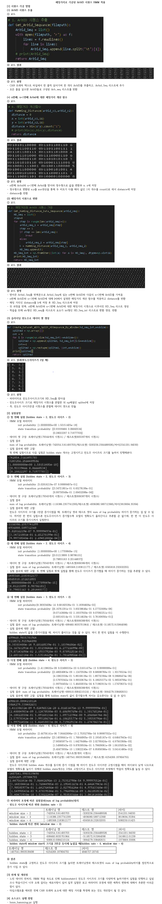
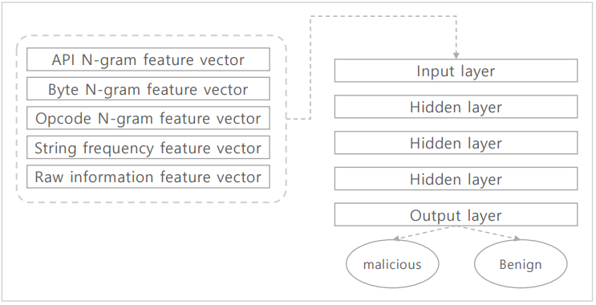
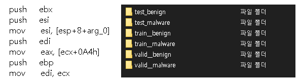
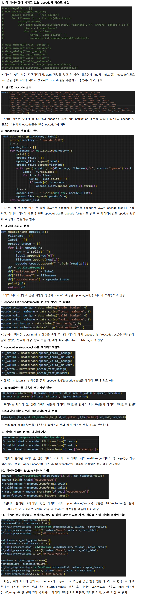

- - -
<!-- 프로젝트 대표 이미지 -->
<p align="center">
    01. HMMCANTrafficAnalysis
</p>

<!-- 프로젝트 대표 이미지 -->
<div align="center">
    
</div>

<!-- 홈페이지 링크
<div align=center>
    <h3>
        🌐 시연영상
        <a href="{실행동영상 유튜브 링크}">유튜브링크</a>
    </h3>
</div> -->

<br>

## 👨🏻‍🏫 프로젝트 개요
<details>
	<summary><b> 프로젝트 소개</b></summary>
    <ul>
        <li>CAN 네트워크에서 정상과 비정상(공격포함)트래픽을 가지고 데이터 가공후 HMM 알고리즘 적용
        </li>
        <li>타임스탬프가 1씩 증가하는 단위시간 동안의 각 Arbid 호출을 엔트로피 시퀀스로 가공 및 HMM 적용
        </li>
         <li>해밍 거리로 가공후 ArbId 시퀀스 HMM 적용
        </li>
    </ul>
</details>

<br>

<details>
	<summary><b> 프로젝트 실행</b></summary>
   
```bash
# prerequisites: python
# execution
git clone https://github.com/MpqM/ML_HMMCANTrafficAnalysis
python hmm_hamming_Arbid.py
python hmm_antropy.py
```

</details>

<br>

<details>
	<summary><b> 주요 기능 설명</b></summary>
    <ul>
        <b> Data Set Sample</b>
            <p align ="center">
               
            </p>
        <b> Arbid Time Stamp Method</b>
            <p align ="center">
               
            </p>
        <b> Arbid Haming Distance Method</b>
         <p align ="center">
            
         </p>
    </ul>
</details>

<br>

## 💻 기술스택
| **Category** |**Skills**| 
|-------------|---------|
|**Language**|  |

<br>

- - -

<br>

<!-- 제목 -->
<p align="center">
    02. MaliciousCodeAnalysis
</p>

<!-- 프로젝트 대표 이미지 -->
<div align="center">
    
</div>

<!-- 홈페이지 링크
<div align=center>
    <h3>
        🌐 시연영상
        <a href="{실행동영상 유튜브 링크}">유튜브링크</a>
    </h3>
</div> -->

<br>

## 👨🏻‍🏫 프로젝트 개요

<details>
	<summary><b> 프로젝트 소개</b></summary>
    <ul>
        <li>N-GRAM 기반 탐지를 이용해 Opcode를 토큰으로하는 Opcode N-Gram을 이용해 머신러닝 기반 악성코드 탐지를 구현
        </li>
        <li>test(정상, 악성), train(정상, 악성), valid(정상, 악성)로 이루어진 데이터의 OPcode를 추출해 N-Gram으로 가공후 특징정보 추출
        </li>
        <li>tensorflow를 이용해 모델 학습 수행
        </li>
    </ul>
</details>

<br>

<details>
	<summary><b> 프로젝트 실행</b></summary>

```bash
# prerequisites: python
# execution
git clone https://github.com/MpqM/ML_MaliciousCodeAnalysis
python ganada-1.py
```

</details>

<br>

<details>
   <summary><b> 주요 기능 설명</b></summary>
   <ul>
	<b> Data Set Sample</b>
   <p align ="center">
      
   </p>
	<b> 6개의 데이터셋들에서 opcodeTrace 추출, target(mal/benign)과 feature(n-gram)데이터 가공</b>
   <p align ="center">
      
   </p>
	<b> 모델 학습</b>
   <p align ="center">
      
   </p>
   </ul>
</details>

<br>

## 💻 기술스택

| **Category** |**Skills**| 
|-------------|---------|
|**Language**|  |