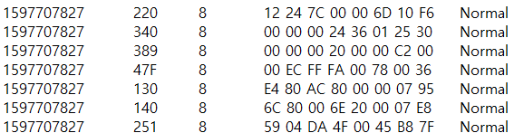
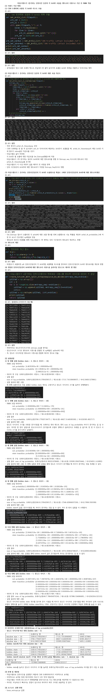
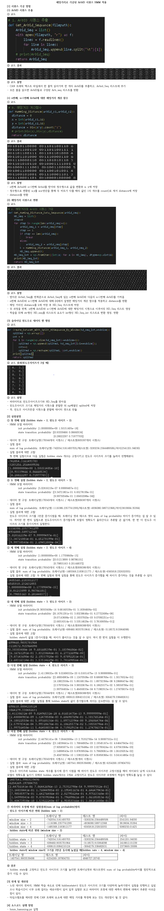
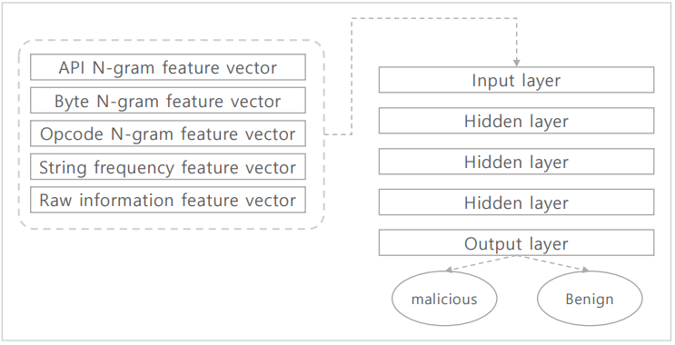
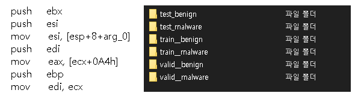
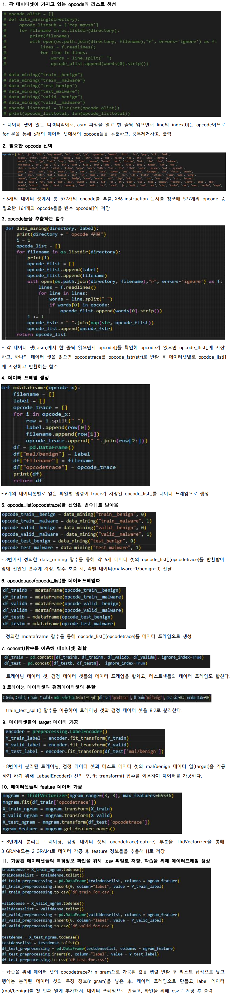
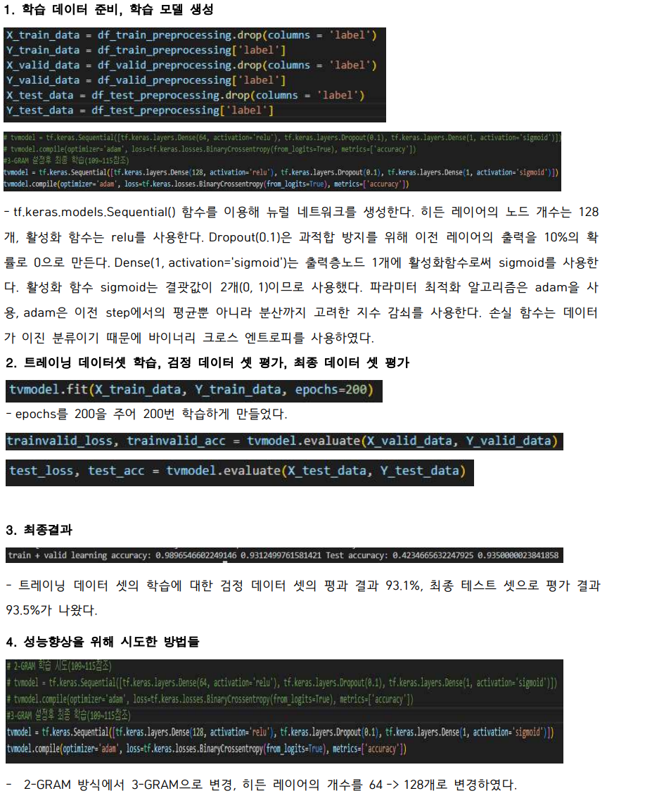

# 01. HMMCANTrafficAnalysis
#### ⚪ About Project
* ##### CAN 네트워크에서 정상과 비정상(공격포함)트래픽을 가지고 데이터 가공후 HMM 알고리즘 적용
* ##### 타임스탬프가 1씩 증가하는 단위시간 동안의 각 Arbid 호출을 엔트로피 시퀀스로 가공 및 HMM 적용
* ##### 해밍 거리로 가공후 ArbId 시퀀스 HMM 적용

- - -

#### ⚪ Running Screen || Video
<p align ="center">
   
</p>

- - -

#### ⚪ Built with
<p align ="center">
   
</p>

- - -

#### ⚪ Getting Started
```bash
# prerequisites: python
# execution
git clone https://github.com/MpqM/ML_HMMCANTrafficAnalysis
python hmm_hamming_Arbid.py
python hmm_antropy.py
```

- - -

#### ⚪ Description
* ##### Data Set Sample
<p align ="center">
   
</p>

* ##### Arbid Time Stamp Method
<p align ="center">
   
</p>

* ##### Arbid Haming Distance Method
<p align ="center">
   
</p>

- - -

#### ⚪ Writer
<p align ="center">
  </a> <a href = "https://github.com/MpqM"></a> <a href = "https://MpqM.tistory.com/"> </a>
</p>

- - -

<br>

- - -

# 02. MaliciousCodeAnalysis
#### ⚪ About Project
* ##### N-GRAM 기반 탐지를 이용해 Opcode를 토큰으로하는 Opcode N-Gram을 이용해 머신러닝 기반 악성코드 탐지를 구현
* ##### test(정상, 악성), train(정상, 악성), valid(정상, 악성)로 이루어진 데이터의 OPcode를 추출해 N-Gram으로 가공후 특징정보 추출
* ##### tensorflow를 이용해 모델 학습 수행

- - -

#### ⚪ Running Screen || Video
<p align ="center">
   
</p>

- - -

#### ⚪ Built with
<p align ="center">
   
</p>

- - -

#### ⚪ Getting Started
```bash
# prerequisites: python
# execution
git clone https://github.com/MpqM/ML_MaliciousCodeAnalysis
python ganada-1.py
```

- - -

#### ⚪ Description 
* ##### Data Set Sample
<p align ="center">
   
</p>

* ##### 6개의 데이터셋들에서 opcodeTrace 추출, target(mal/benign)과 feature(n-gram)데이터 가공
<p align ="center">
   
</p>

* ##### 모델 학습
<p align ="center">
   
</p>

- - -

#### ⚪ Writer
<p align ="center">
  </a> <a href = "https://github.com/MpqM"></a> <a href = "https://MpqM.tistory.com/"> </a>
</p>

- - -