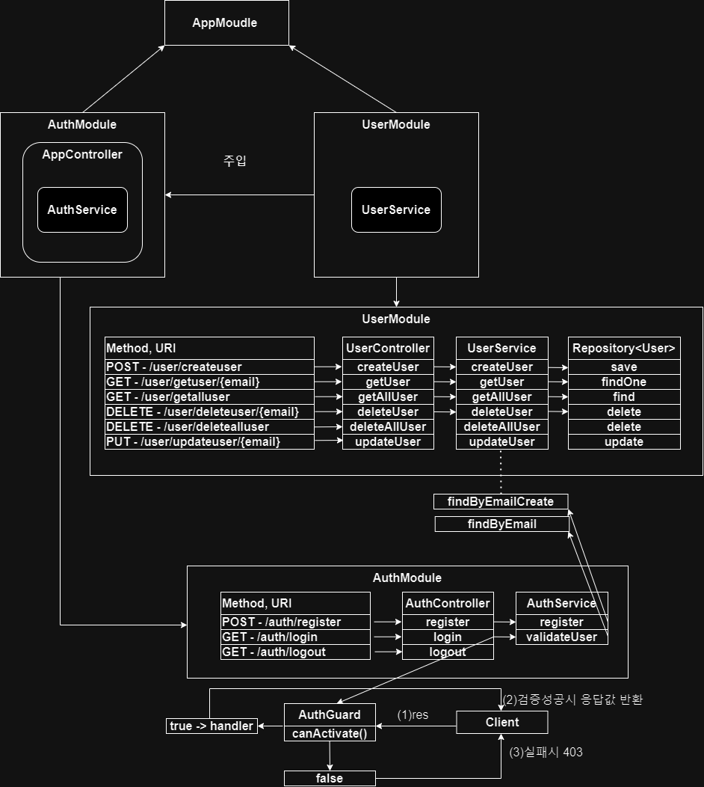
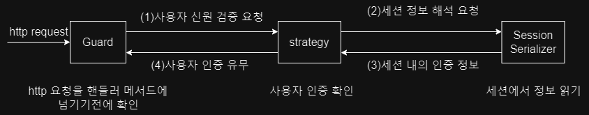
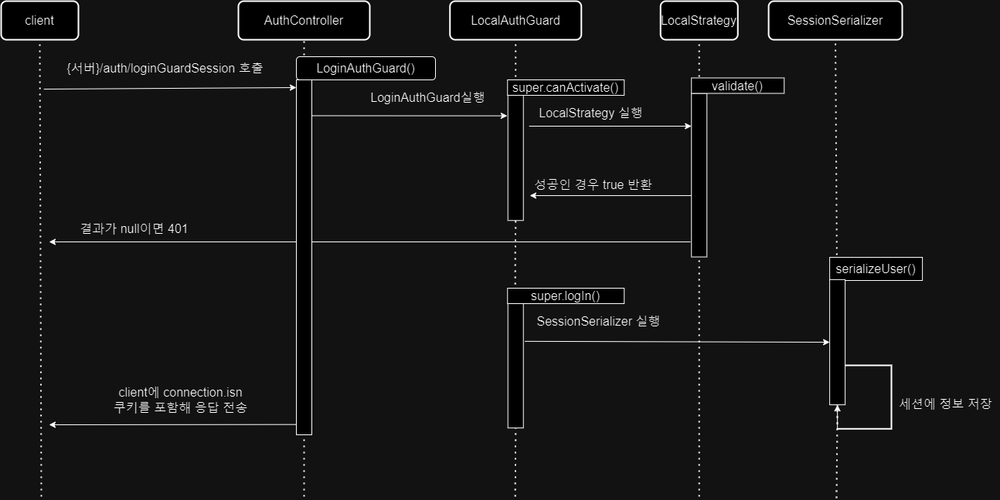
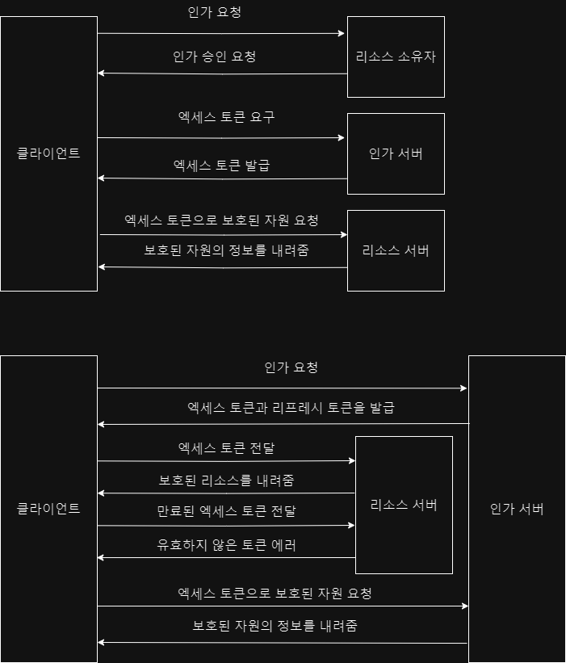
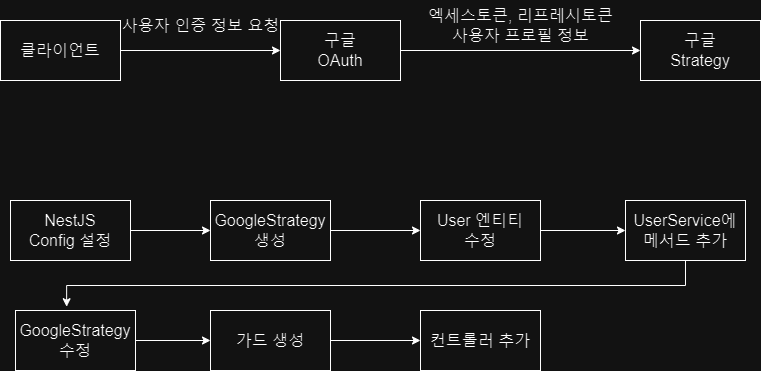
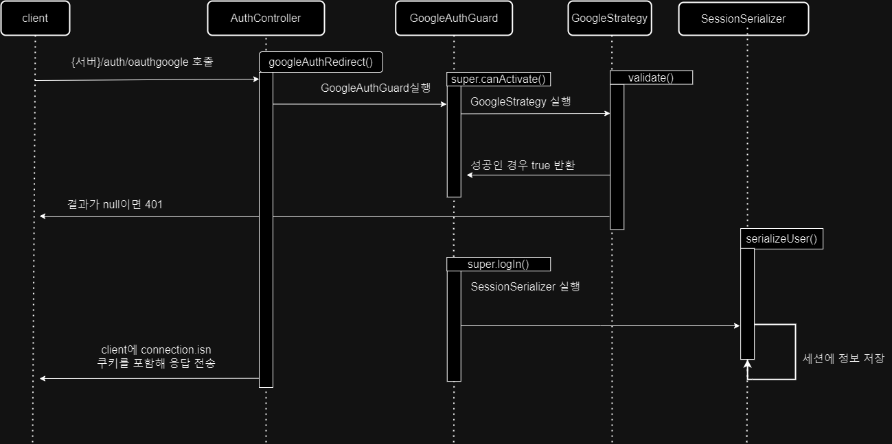
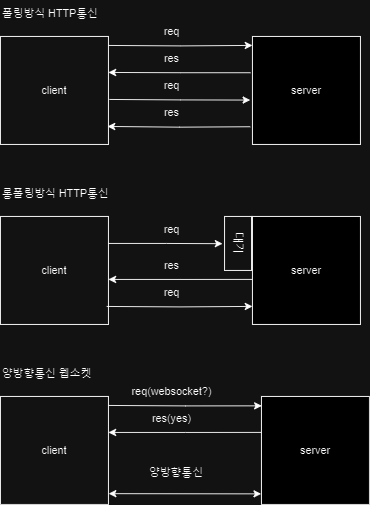

- - -
# 02. Blog

<div align="center">
      <a href="http://nestjs.com/" target="blank"></a>

  | **Category** |**Skills**| 
  |-------------|---------|
  |**Backend**|   |
</div>

## 프로젝트 설명
<details>
	<summary><b> 프로젝트 개요</b></summary>
    <ul>
        <li>NestJS로 Blog API 만들기, 의존성 주입, 몽고DB 연동하기 연습
        </li>
        <li>Blog글 객체에 대한 생성, 조회, 전체조회, 수정, 삭제, 전체삭제기능 API
        </li>
    </ul>
</details>

<br>

<details>
	<summary><b> 프로젝트 실행</b></summary>

```bash
# Prerequisites: npm, node, MongoDB Connection URL
git clone https://github.com/MpqM/NestJS_Blog.git
cd {project}
npm install
# Change YOUR MONGODB CONNECTION STRING in ./src/app.moudle.ts
# development
npm run start
# watch mode
npm run start:dev
# production mode
npm run start:prod
# unit tests
npm run test
# e2e tests
npm run test:e2e
# test coverage
npm run test:cov
```
</details>

## 기능 설명
<details>
	<summary><b> 게시글 </b></summary>
    <ul>
        <li>getAllPost(): 모든 블로그 글 가져오기
        </li>
        <li>createPost(): 새로운 블로그 글 작성
        </li>
        <li>getPost(): 특정 ID의 블로그 글 가져오기
        </li>
        <li>deletePost(): 특정 ID의 블로그 글 삭제
        </li>
        <li>deleteAllPost(): 모든 블로그 글 삭제
        </li>
        <li>updatePost(): 특정 ID의 블로그 글 업데이트
        </li>
        <li>postman collection으로 테스트 가능
        </li>
    </ul>
</details>

- - -

<br>

- - -

# 06. Auth
<div align="center">
      <a href="http://nestjs.com/" target="blank"></a>

  | **Category** |**Skills**| 
  |-------------|---------|
  |**Backend**|     |
</div>

## 프로젝트 설명
<details>
	<summary><b> 프로젝트 개요</b></summary>
    <ul>
        <li>유저생성, 조회, 전체조회, 수정, 삭제, 전체삭제기능 API 사용자 모듈, Sqlite DB를 이용
        </li>
        <li>파이프로 유효성검증(Validataion Pipe, Guard, class-validator), Guard를 통한 핸드러 메서드 전 인증검증
        </li>
        <li>로그인, 회원가입 API 인증모듈에서 쿠키, 세션과 PassPort(Strategy, Session Serializer)을 사용한 인증 구현
        </li>
        <li>
        OAuth2.0을 활용한 구글 로그인 인증, GoogleAuthGuard를 통해 세션 사용
        </li>
    </ul>
</details>

<br>

<details>
	<summary><b> 프로젝트 실행</b></summary>

```bash
# prerequisites: npm, node, sqlite viewr vscode extension
# execution
git clone https://github.com/MpqM/NestJS_Auth.git
cd {project}
npm install
npm run start
# test
http://localhost:3000/auth/logingoogle
http://localhost:3000/auth/testloginsession
```
</details>

## 기능 설명
<details>
	<summary><b> 유저, 인증 모듈, 가드</b></summary>
  <p align ="center">
    
  </p>
</details>
<br>
<details>
	<summary><b> 페스포트와 세션을 사용한 인증 과정</b></summary>
  <p align ="center">
    
  </p>
</details>
<br>
<details>
	<summary><b> 로그인부터 세션 저장까지 순서도</b></summary>
  <p align ="center">
    
  </p>
</details>
<br>
<details>
	<summary><b> OAuth 프로토콜 흐름, 엑세스 토큰 만료시 리프레시 토큰을 통한 재발행 </b></summary>
  <p align ="center">
    
  </p>
</details>
<br>
<details>
	<summary><b> 구글 OAuth 구현 순서 </b></summary>
  <p align ="center">
    
  </p>
</details>
<br>
<details>
	<summary><b> GoogleAuthGuard의 동작 순서도 </b></summary>
  <p align ="center">
    
  </p>
</details>

- - -

<br>

- - -

# 07. Board
<div align="center">
      <a href="http://nestjs.com/" target="blank"></a>

  | **Category** |**Skills**| 
  |-------------|---------|
  |**Backend**|    |
</div>

## 프로젝트 설명
<details>
	<summary><b> 프로젝트 개요</b></summary>
    <ul>
        <li>인증된 사용자가 작성한 게시글은 사용자에게 종속된 접근권한 분리형 게시판 서비스
        </li>
        <li>게시글, 유저 API, 관계형 데이터 베이스인 Postgresql로 권한분리 구현
        </li>
        <li>인증 API, Passport(Jwt-Strategy), Jwt accessToken을 사용한 인증 구현
        </li>
    </ul>
</details>

<br>

<details>
	<summary><b> 프로젝트 실행</b></summary>

```bash
# Prerequisites: npm, node, Postgresql
# execution
git clone https://github.com/MpqM/NestJS_Board.git
npm install
npm run start
```

</details>

## 기능 설명
<details>
	<summary><b> User </b></summary>
    <ul>
        <li>createUser: 사용자 엔티티 생성 및 저장
        </li>
        <li>getUser: 주어진 이메일을 이용해 사용자 조회
        </li>
        <li>getAllUser: 모든 사용자 조회 후 반환
        </li>
        <li>updateUser: 주어진 이메일을 이용해 사용자 조회 후 사용자 객체 비밀번호 해시 후 업데이트
        </li>
        <li>deleteUser: 주어진 이메일을 이용해 사용자 삭제
        </li>
    </ul>
</details>
<br>
<details>
	<summary><b> Board</b></summary>
    <ul>
        <li>createBoard: 게시물 엔티티 생성 및 저장
        </li>
        <li>getBoard: 주어진 ID를 이용해 게시글 조회
        </li>
        <li>getAllBoard: 유저가 가진 모든 게시글 조회
        </li>
        <li>updateBoard: 유저가 가진 게시글 업데이트
        </li>
        <li>deleteBoard: 유저가 가진 게시글을 삭제
        </li>
    </ul>
</details>
<br>
<details>
	<summary><b> Auth</b></summary>
    <ul>
        <li>register: getUser로 사용자 존재여부 확인, 비밀번호 해시화후 createUser에 주입해 사용자 등록
        </li>
        <li>login: getUser로 사용자 존재여부 확인, 비밀번호 비교후 JWT accessToken 생성
        </li>
    </ul>
</details>
<br>
<details>
	<summary><b> Else</b></summary>
    <ul>
        <li>PassPort와 JWT Strategy를 이용한 사용자 인증, Guard를 통한 핸들러 메서드에 전달전 검증
        </li>
        <li>TypeORM 설정과 Entity를 통한 Postgresql 연동
        </li>
        <li>Class-validator, ValidationPipe를 통한 유효성 검증
        </li>
        <li>User와 Board Entity간 관계형성으로 접근권한 분리
        </li>
    </ul>
</details>

- - -

<br>

- - -

# 08. Chat
<div align="center">
  <p align ="center">
    <a href=""></a>
    </br>
    
  </p>
    <h3>
    시연영상
      <a href="https://www.youtube.com/watch?v=1UvK-YwjQaA">유튜브링크</a>
    </h3> 
   <br>

   | **Category** |**Skills**| 
   |-------------|---------|
   |**Frontend & Language**|  
   |**Backend**|   

</div>

## 프로젝트 설명
<details>
	<summary><b> 프로젝트 개요</b></summary>
    <ul>
        <li>웹소켓을 사용한 실시간 채팅 구현
        </li>
        <li>NestJS, 웹소켓 게이트웨이를 통해 서버와 클라이언트간 양방향 통신 지원
        </li>
    </ul>
</details>

<br>

<details>
	<summary><b> 프로젝트 실행</b></summary>

  ```bash
  # prerequisites: npm, node
  # execution
  git clone https://github.com/MpqM/NestJS_Auth.git
  cd {project}
  npm install
  npm run start
  ```
</details>

## 기능 설명
<details>
	<summary><b> chat </b></summary>
  <p align ="center">
    
  </p>
</details>
