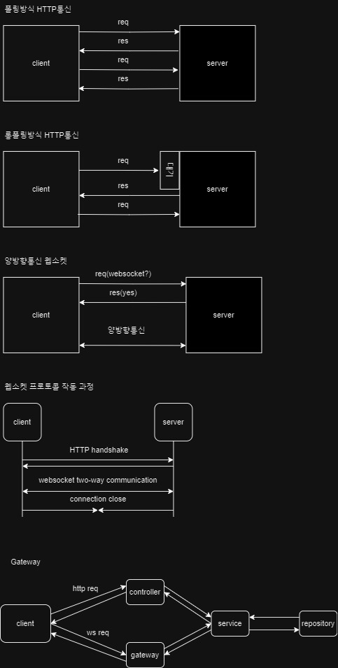

# 02. Blog

<div align="center">
    <a href="http://nestjs.com/" target="blank"></a>
</div>

<br>

<details>
<summary><b> 📌 프로젝트 개요</b></summary>
<br>

- NestJS로 Blog API 만들기, 의존성 주입, 몽고DB 연동하기 연습
- Blog글 객체에 대한 생성, 조회, 전체조회, 수정, 삭제, 전체삭제기능 API

</details>

<br>

<details>
<summary><b> 🏃 프로젝트 실행</b></summary>
<br>

```bash
# Prerequisites: npm, node, MongoDB Connection URL
git clone https://github.com/MpqM/NestJS_Blog.git
cd {project}
npm install
# Change YOUR MONGODB CONNECTION STRING in ./src/app.moudle.ts
# development
npm run start
# watch mode
npm run start:dev
# production mode
npm run start:prod
# unit tests
npm run test
# e2e tests
npm run test:e2e
# test coverage
npm run test:cov
```
</details>

<br>

<details>
<summary><b> 🚀 프로젝트 설명</b></summary>
<br>

- 게시글
  - getAllPost(): 모든 블로그 글 가져오기
  - createPost(): 새로운 블로그 글 작성
  - getPost(): 특정 ID의 블로그 글 가져오기
  - deletePost(): 특정 ID의 블로그 글 삭제
  - deleteAllPost(): 모든 블로그 글 삭제
  - updatePost(): 특정 ID의 블로그 글 업데이트
  - postman collection으로 테스트 가능

</details>

<br>

<details>
<summary><b> 🎮 프로젝트 스택</b></summary>
<br>

| **CATEGORY** | **SKILLS**                                                                                                                                                                                                              | 
|--------------|-------------------------------------------------------------------------------------------------------------------------------------------------------------------------------------------------------------------------| 
| **BACKEND**  |   |
| **TEST**     |                                                                                                            |
</details>

<br>

- - -

# 06. Auth

<div align="center">
    <a href="http://nestjs.com/" target="blank"></a>
</div>

<br>

<details>
<summary><b> 📌 프로젝트 개요</b></summary>
<br>

- 유저생성, 조회, 전체조회, 수정, 삭제, 전체삭제기능 API 사용자 모듈, Sqlite DB를 이용
- 파이프로 유효성검증(Validataion Pipe, Guard, class-validator), Guard를 통한 핸드러 메서드 전 인증검증
- 로그인, 회원가입 API 인증모듈에서 쿠키, 세션과 PassPort(Strategy, Session Serializer)을 사용한 인증 구현
- OAuth2.0을 활용한 구글 로그인 인증, GoogleAuthGuard를 통해 세션 사용

</details>

<br>

<details>
<summary><b> 🏃 프로젝트 실행</b></summary>
<br>

```bash
# prerequisites: npm, node, sqlite viewr vscode extension
# execution
git clone https://github.com/MpqM/NestJS_Auth.git
cd {project}
npm install
npm run start
# test
http://localhost:3000/auth/logingoogle
http://localhost:3000/auth/testloginsession
```
</details>

<br>

<details>
<summary><b> 🚀 프로젝트 설명</b></summary>
<br>

- 유저, 인증 모듈, 가드
<p align ="center">
  
</p>

- 페스포트와 세션을 사용한 인증 과정
<p align ="center">
  
</p>

- 로그인부터 세션 저장까지 순서도
<p align ="center">
  
</p>

- OAuth 프로토콜 흐름, 엑세스 토큰 만료시 리프레시 토큰을 통한 재발행 </b>
<p align ="center">
  
</p>

- 구글 OAuth 구현 순서
<p align ="center">
  
</p>

- GoogleAuthGuard의 동작 순서도
<p align ="center">
  
</p>

</details>

<br>

<details>
<summary><b> 🎮 프로젝트 스택</b></summary>
<br>

| **CATEGORY** | **SKILLS**                                                                                                                                                                                                              | 
|--------------|-------------------------------------------------------------------------------------------------------------------------------------------------------------------------------------------------------------------------|
| **BACKEND**  |   |
| **DATABASE** |                                                                                                               |
| **TEST**     |                                                                                                            |
</details>

<br>

- - -

#  07. Board
<div align="center">
    <a href="http://nestjs.com/" target="blank"></a>
</div>

<br>

<details>
<summary><b> 📌 프로젝트 개요</b></summary>
<br>

- 인증된 사용자가 작성한 게시글은 사용자에게 종속된 접근권한 분리형 게시판 서비스
- 게시글, 유저 API, 관계형 데이터 베이스인 Postgresql로 권한분리 구현
- 인증 API, Passport(Jwt-Strategy), Jwt accessToken을 사용한 인증 구현

</details>

<br>

<details>
<summary><b> 🏃 프로젝트 실행</b></summary>
<br>

```bash
# Prerequisites: npm, node, Postgresql
# execution
git clone https://github.com/MpqM/NestJS_Board.git
npm install
npm run start
```

</details>

<br>

<details>
<summary><b> 🚀 프로젝트 설명</b></summary>
<br>

- User
  - createUser: 사용자 엔티티 생성 및 저장
  - getUser: 주어진 이메일을 이용해 사용자 조회
  - getAllUser: 모든 사용자 조회 후 반환
  - updateUser: 주어진 이메일을 이용해 사용자 조회 후 사용자 객체 비밀번호 해시 후 업데이트
  - deleteUser: 주어진 이메일을 이용해 사용자 삭제
- Board
  - createBoard: 게시물 엔티티 생성 및 저장
  - getBoard: 주어진 ID를 이용해 게시글 조회
  - getAllBoard: 유저가 가진 모든 게시글 조회
  - updateBoard: 유저가 가진 게시글 업데이트
  - deleteBoard: 유저가 가진 게시글을 삭제
- Auth
  - register: getUser로 사용자 존재여부 확인, 비밀번호 해시화후 createUser에 주입해 사용자 등록  
  - login: getUser로 사용자 존재여부 확인, 비밀번호 비교후 JWT accessToken 생성
- Else 
  - PassPort와 JWT Strategy를 이용한 사용자 인증, Guard를 통한 핸들러 메서드에 전달전 검증
  - TypeORM 설정과 Entity를 통한 Postgresql 연동
  - Class-validator, ValidationPipe를 통한 유효성 검증
  - User와 Board Entity간 관계형성으로 접근권한 분리

</details>

<br>

<details>
<summary><b> 🎮 프로젝트 스택</b></summary>
<br>

| **CATEGORY** | **SKILLS**                                                                                                                                                                                                              | 
|--------------|-------------------------------------------------------------------------------------------------------------------------------------------------------------------------------------------------------------------------| 
| **BACKEND**  |   |
| **DATABASE** |                                                                                                   |
| **TEST**     |                                                                                                            |
</details>

<br>

- - -

# 08. Chat
<p align ="center">
  
</p>

<br>

<details>
<summary><b> 📌 프로젝트 개요</b></summary>
<br>

- 웹소켓을 사용한 실시간 채팅 구현
- NestJS, 웹소켓 게이트웨이를 통해 서버와 클라이언트간 양방향 통신 지원

</details>

<br>

<details>
<summary><b> 🏃 프로젝트 실행</b></summary>
<br>

  ```bash
  # prerequisites: npm, node
  # execution
  git clone https://github.com/MpqM/NestJS_Auth.git
  cd {project}
  npm install
  npm run start
  ```
</details>

<br>

<details>
<summary><b> 🚀 프로젝트 설명</b></summary>
<br>

- chat
<p align ="center">
  
</p>

</details>

<br>

<details>
<summary><b> 🎮 프로젝트 스택</b></summary>
<br>

| **CATEGORY** | **SKILLS**                                                                                                                                                                                                                                                                                                                               | 
|--------------|------------------------------------------------------------------------------------------------------------------------------------------------------------------------------------------------------------------------------------------------------------------------------------------------------------------------------------------|
| **FRONTEND** |        | 
| **BACKEND**  |    |
| **DATABASE** |                                                                                                                                                                                                                    |
| **TEST**     |                                                                                                                                                                                                                             |

</details>

<br>