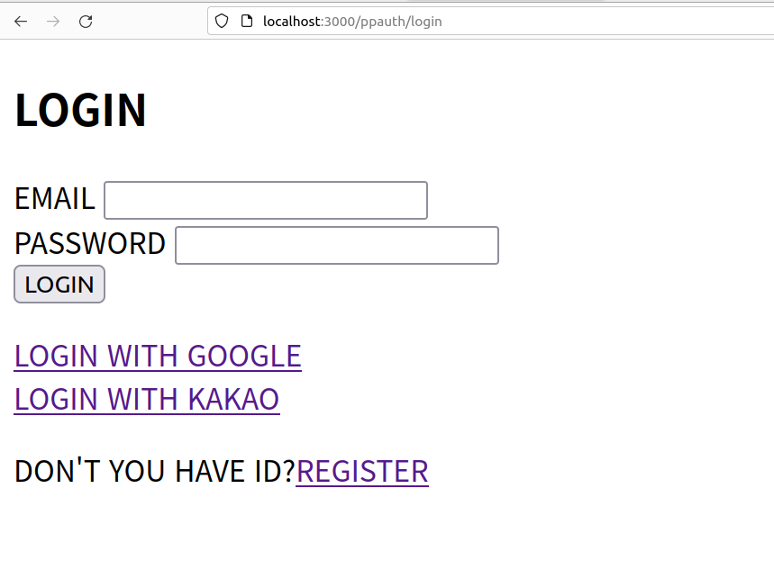
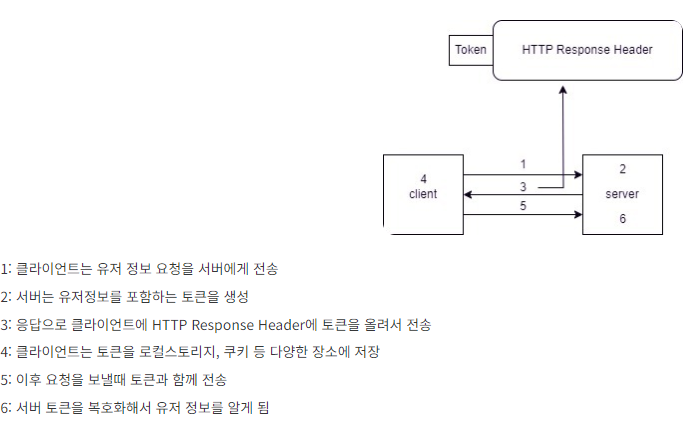
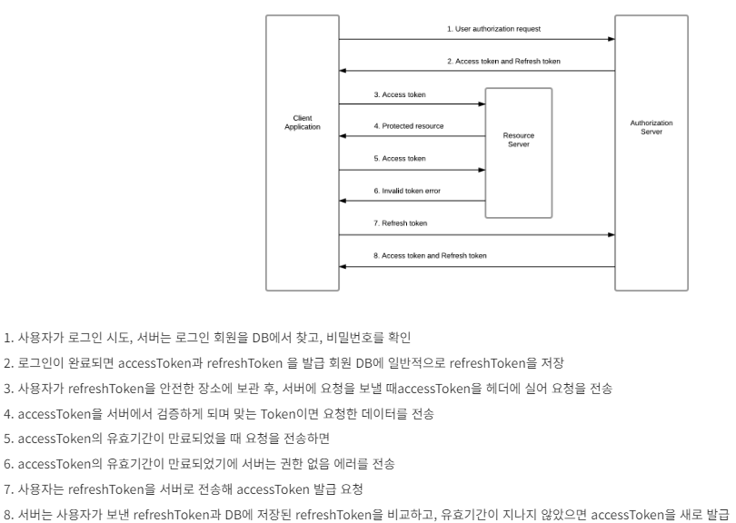
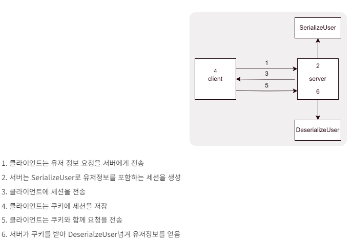
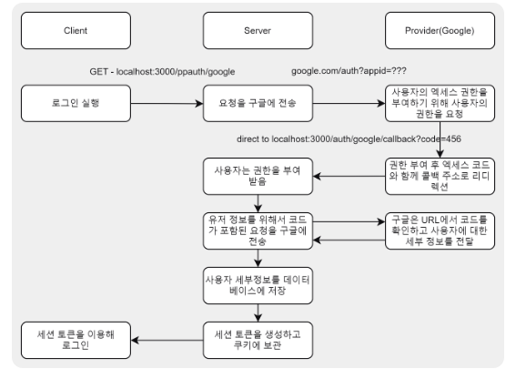

# 14. Auth
#### ⚪ About Project
* ##### jwt 엑세스토큰, 리프레시토큰 사용 인증 구현
* ##### 쿠키세션 + PassPort(Strategy, Session Serializer, deSerializer)를 사용한 인증 구현
* ##### jwt, passport를 통해 인증받은 사용자 만이 리소스에 접근하게 하는 미들웨어 구현
* ##### Mongoose를 이용해 Oauth ID 및 사용자 정보 모델, P/W 함수(저장 전 해싱, 비교) 정의

- - -

#### ⚪ Running Screen || Video
<p align ="center">
  <a href="https://www.youtube.com/watch?v=vQkZ0dgmi9I"></a>
  </br>
  
</p>

- - -

#### ⚪ Built With
<p align ="center">
      
</p>

- - -

#### ⚪ Getting Started
  ```bash
  # prerequisites: npm, node, MongoDB Connection URI, Kakao Client ID, Google Oauth Client ID
  # execution
  git clone https://github.com/MpqM/NodeJS_Auth.git
  # Change the .env with yours
  npm install
  npm start
  # test: http://localhost:3000/ppauth/
  # 소스코드 주석, Postman 참조
  ```

- - -

#### ⚪ Description
* ##### jwt 기반 인증 인가
 <p align ="center"></p>
 
* ##### jwt 엑세스, 리프레시 토큰
 <p align ="center"></p>

* ##### Passport를 이용한 쿠키 세션
 <p align ="center"></p>

* ##### Oauth 인증 흐름
 <p align ="center"></p>

- - -

#### ⚪ Writer
<p align ="center">
  </a> <a href = "https://github.com/MpqM"></a> <a href = "https://MpqM.tistory.com/"> </a>
</p>

- - -

