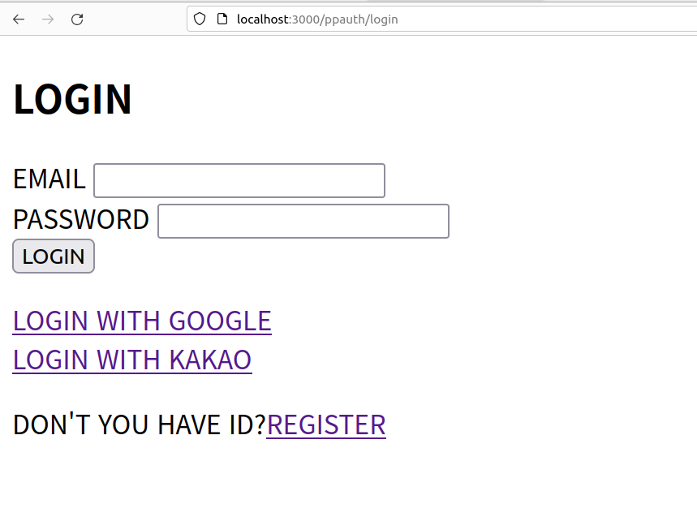
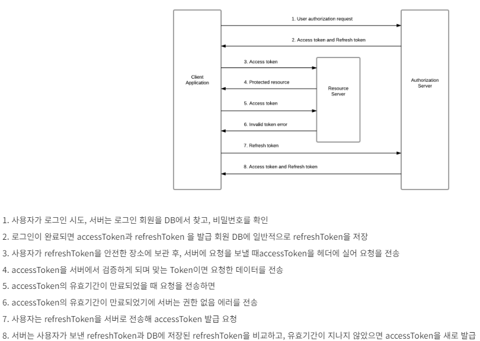
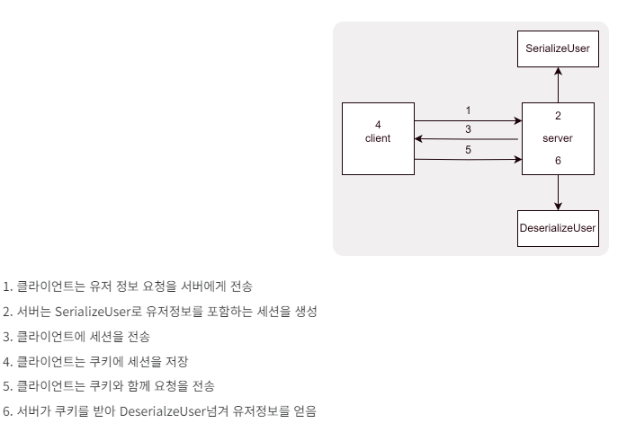

# 14. Auth
<div align="center">
    
</div>
<div align=center>
    <h3>
        🌐 시연영상
        <a href="https://www.youtube.com/watch?v=vQkZ0dgmi9I">유튜브링크</a>
    </h3>
</div>

<br>

<details>
<summary><b> 📌 프로젝트 개요</b></summary>
<br>

- jwt 엑세스토큰, 리프레시토큰 사용 인증 구현
- 쿠키세션 + PassPort(Strategy, Session Serializer, deSerializer)를 사용한 인증 구현
- jwt, passport를 통해 인증받은 사용자 만이 리소스에 접근하게 하는 미들웨어 구현
- Mongoose를 이용해 Oauth ID 및 사용자 정보 모델, P/W 함수(저장 전 해싱, 비교) 정의

</details>

<br>

<details>
<summary><b> 🏃 프로젝트 실행</b></summary>
<br>

```bash
# prerequisites: npm, node, MongoDB Connection URI, Kakao Client ID, Google Oauth Client ID
# execution
git clone https://github.com/MpqM/NodeJS_Auth.git
# Change the .env with yours
npm install
npm start
# test: http://localhost:3000/ppauth/
# 소스코드 주석, Postman 참조
```

</details>

<br>

<details>
<summary><b> 🚀 프로젝트 설명</b></summary>
<br>

- jwt 기반 인증 인가
<p align ="center"></p>

- jwt 엑세스, 리프레시 토큰
<p align ="center"></p>

- Passport를 이용한 쿠키 세션
<p align ="center"></p>

- Oauth 인증 흐름
<p align ="center"></p>

</details>

<br>

<details>
<summary><b> 🎮 프로젝트 스택</b></summary>
<br>

| **CATEGORY** | **SKILLS**                                                                                                                                                                                                                                                                                                                                | 
|--------------|-------------------------------------------------------------------------------------------------------------------------------------------------------------------------------------------------------------------------------------------------------------------------------------------------------------------------------------------|
| **FRONTEND** |                                                                                                                                                                                                                                |
| **BACKEND**  |    |
| **DATABASE** |                                                                                                                                                                                                                              |

</details>

<br>