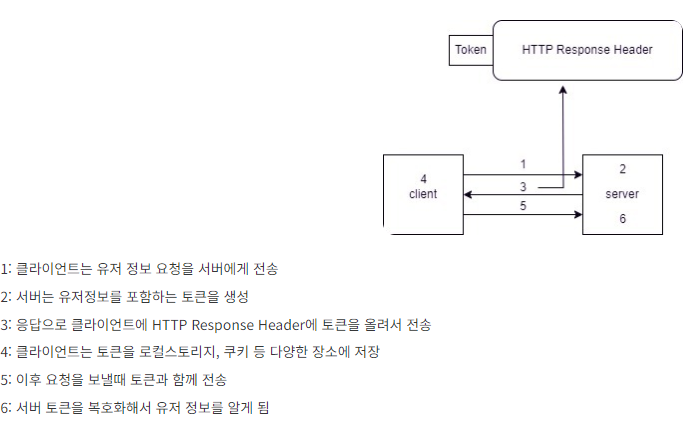
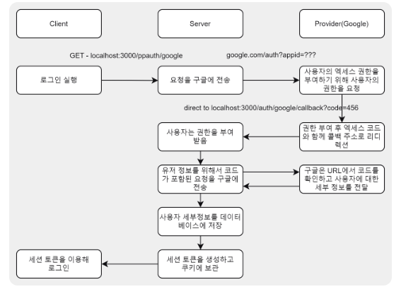

- - -
# 14. Auth
<div align="center">
    
      <h3>
      🌐 시연영상
        <a href="https://www.youtube.com/watch?v=vQkZ0dgmi9I">유튜브링크</a>
      </h3>

  | **Category** |**Skills**| 
  |-------------|---------|
  |**Language**|  |
  |**Frontend**|   |
  |**Backend**|    |
  | **Database**| 

</div>

## 프로젝트 설명
<details>
	<summary><b> 프로젝트 개요</b></summary>
    <ul>
        <li>jwt 엑세스토큰, 리프레시토큰 사용 인증 구현
        </li>
        <li>쿠키세션 + PassPort(Strategy, Session Serializer, deSerializer)를 사용한 인증 구현
        </li>
        <li>jwt, passport를 통해 인증받은 사용자 만이 리소스에 접근하게 하는 미들웨어 구현
        </li>
        <li>Mongoose를 이용해 Oauth ID 및 사용자 정보 모델, P/W 함수(저장 전 해싱, 비교) 정의
        </li>
    </ul>
</details>

<br>

<details>
	<summary><b> 프로젝트 실행</b></summary>

```bash
# prerequisites: npm, node, MongoDB Connection URI, Kakao Client ID, Google Oauth Client ID
# execution
git clone https://github.com/MpqM/NodeJS_Auth.git
# Change the .env with yours
npm install
npm start
# test: http://localhost:3000/ppauth/
# 소스코드 주석, Postman 참조
```

</details>

<br>

## 기능 설명
<details>
	<summary><b> jwt 기반 인증 인가 </b></summary>
 <p align ="center"></p>
</details>
<br>
<details>
	<summary><b>jwt 엑세스, 리프레시 토큰</b></summary>
 <p align ="center"></p>
</details>
<br>
<details>
	<summary><b> Passport를 이용한 쿠키 세션</b></summary>
  <p align ="center"></p>
</details>
<br>
<details>
	<summary><b> Oauth 인증 흐름</b></summary>
  <p align ="center"></p>
</details>